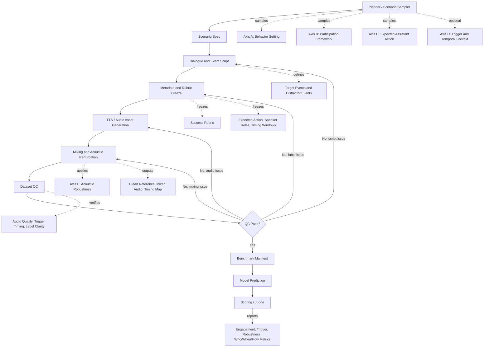
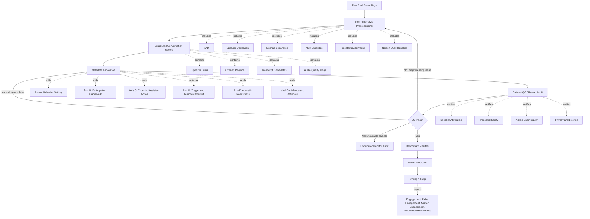

# Data Construction Pipelines

Interaction-Bench can use two complementary construction routes: a controlled
synthetic scenario pipeline and a naturalistic real-recording pipeline.

## Route A: Synthetic Scenario Pipeline

## Route B: Real Recording Pipeline

